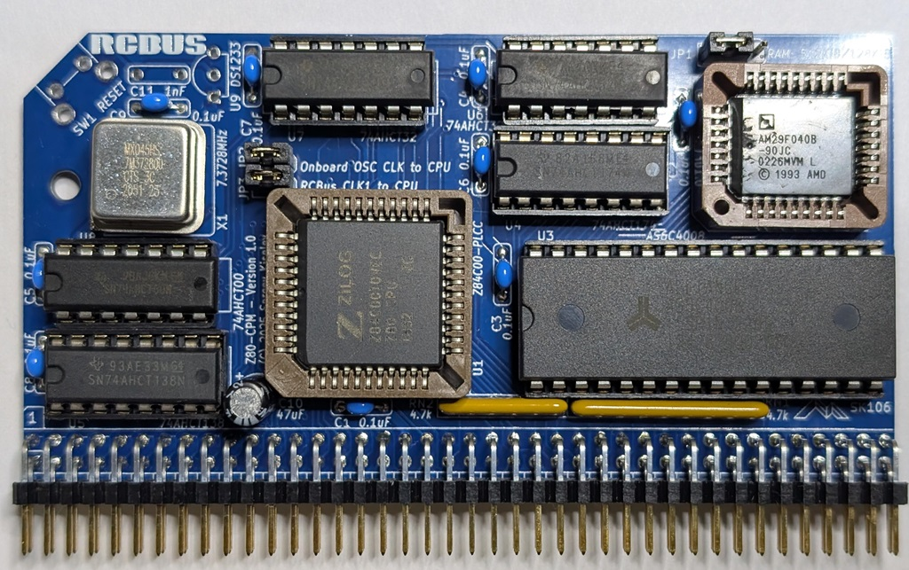

# Z80-CPM - Assembly Instructions

## Prerequisites

### Tools, Equipment, and Supplies

* Soldering iron with a fine tip. Temperature controlled soldering station is recommended
* Needle nose pliers for forming components' leads
* Small side cutters for cutting components' leads
* Universal programmer capable of programming SST39F040 Flash ROM ICs. For example, MiniPro TL866CS or MiniPro TL866A
* Multimeter with frequency measurement, an oscilloscope, or a logic analyzer can be beneficial for troubleshooting
* Desk lamp, magnifying glass
* Solder suitable for soldering electronics. For example: rosin core Sn63/Pb37, Sn60/Pb40, or a lead-free solder such as Sn96.5/Ag3.0/Cu0.5 (sometimes referred to as SAC305)
* Solder wick for removing excess of solder
* 99% Isopropyl Alcohol for removing the excess of flux after soldering
* Lint free wipes, used toothbrush, cotton swabs for cleaning the PCB before and after soldering

### Parts

The table below shows the images of the components included in the kit. The up to date list of parts provided in the [Bill of Materials](README.md#bill-of-materials) section of the [README.md](README.md) file. It also provides the recommended sources for the parts.

#### TODO: Update the table

## Assembly Steps

### 1. Gather supplies and parts

* Check that you have all the equipment and parts listed in the [Prerequisites](#prerequisites) section above
* Organize your workspace. If available, use ESD-safe surface and ESD strap when working on this project

### 2. Solder the components

#### TODO: Update detailed instructions

Solder the components going from lower profile components to higher profile components, from smaller components to larger. Here is the recommended order:

* Solder RN1 and RN2 resistor arrays. Make sure that resistor arrays are oriented correctly. The first pin of the resistor array is marked with a printed dot, and the first pad on the board has a square shape

* Solder C1-C9 0.1 uF capacitors. Note that these are non-polarized ceramic capacitors, so they can be oriented either way. Trim the leads using cutters

* Solder the sockets. Start with the X1 oscillator socket, continue with DIP integrated circuits' sockets, and finally solder PLCC44 and PLCC32 sockets.
  * Pay attention to the orientation of the sockets. The indents indicating pin 1, or the socket outline on the PCB's silk screen should match the socket orientation

* Solder C10 capacitor. Note that this is a __polarized__ electrolytic capacitor and it needs to be oriented properly. Make sure that the negative lead of the capacitor (marked on the package) matches the white colored area on the PCB.

* Solder RCBus header J1
  
### 3. Check your soldering work

* Make sure all pins of all components are soldered properly
* If desired, clean the flux using isopropyl alcohol, cotton swabs. You might want to scrub the board lightly with a used toothbrush to remove the flux

### 4. Insert the integrated circuits to the sockets
* Prior to inserting DIP integrated circuits to the sockets board, bend their leads slightly, so they point 90 degrees downward. Put the IC on the side and gently push it down to bend the leads. Repeat on the other side of the IC
* Double check that you're placing the integrated circuit in the right socket, check the IC orientation. The index notch on the IC should match the notch on the socket and the drawing on the PCB's silkscreen
* To insert the Z80 CPU and SST39SF040 Flash ROM integrated circuits in PLCC packages, place them on the top of their sockets, double check the orientation of the integrated circuit, and firmly push it down. It should click into the socket

### 5. Install JP1, JP2, and JP3 jumpers

Refer to the [Jumpers Settings](README.md#jumpers-settings) section of the [README.md](README.md) file.

### 6. Test the module
* Plug the module into an RCBus compatible backplane
* Plug a supported serial module, such as Steve Cousins' [[SC716 – RCBus Z80 SIO/2 Serial Module](https://smallcomputercentral.com/sc716-rcbus-z80-sio-2-serial-module/), [SC725 – RCBus Serial and Timer Module](https://smallcomputercentral.com/sc725-rcbus-serial-and-timer-module/), or [SC705 – RCBus Serial ACIA Module](https://smallcomputercentral.com/sc705-rcbus-serial-acia/).
* Double check that the modules are installed in the correct orientation, and pin 1 on the modules match that of the backplane.
* Connect the serial console cable, such as FTDI USB to RS232 to the serial module. Launch terminal emulation software, and configure it for 115200bps, 8-bit, no parity, one stop bit operation.
* Apply the power. The RomWBW prompt should appear on the terminal.

__Congratulations! Enjoy your Z80-CPM Module!__

A CP/M computer system consisting of [Z80-CPM module](https://github.com/skiselev/Z80-CPM), [Flock V2 Floppy Disk Controller and Real Time Clock module](https://github.com/skiselev/flock-v2), [SC725 – RCBus Serial and Timer Module](https://smallcomputercentral.com/sc725-rcbus-serial-and-timer-module/), and [SC701 – RCBUS Backplane](https://smallcomputercentral.com/sc701-rcbus-backplane/):

#### TODO: Add a photo of a complete system
