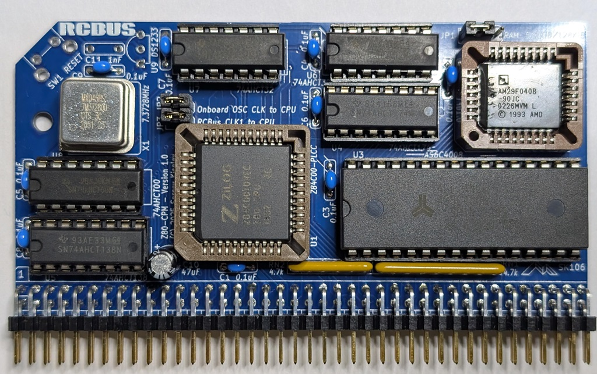

# Z80-CPM
RCBus Z80 CPU, 512 KiB SRAM, and 512 KiB Flash ROM module for RCBus systems designed using discrete logic

## Table of Content
* [Overview](#overview)
  * [Specifications](#specifications)
* [Assembly Instructions](#assembly-instructions)
* [Hardware Documentation](#hardware-documentation)
  * [Schematic and PCB Layout](#schematic-and-pcb-layout)
  * [Input/Output Ports](#inputoutput-ports)
  * [Connectors](#connectors)
  * [Bill of Materials](#bill-of-materials)
* [Release Notes](#release-notes)
  * [Changes](#changes)
  * [Known Issues](#known-issues)
* [Red Tape](#red-tape)
  * [Licensing](#licensing)
  * [Trademarks](#trademarks)

## Overview
Z80-CPM is an RCBus and RC2014* compatible module, designed to run [RomWBW](https://github.com/wwarthen/RomWBW) firmware including CP/M, ZSDOS, and various applications under these OSes. Z80-CPM combines functionality of the following RC2014* modules on a single module, thus saving space on the backplane:
* Z80 CPU Module
* 512k ROM 512k RAM Module - Simplified version, compatible with RomWBW firmware
* Clock and Reset Module

Minimal CP/M computer system can be built using Z80-CPM module, a backplane, and a serial port module, for example Steve Cousins' [SC716](https://smallcomputercentral.com/sc716-rcbus-z80-sio-2-serial-module/) or [SC725](https://smallcomputercentral.com/sc725-rcbus-serial-and-timer-module/) Z80 SIO modules, or MC68B50 ACIA. Additional storage module is not required, since RomWBW utilizes part of ROM and SRAM for ROM and RAM disks respecitvely, but a Compact Flash module can be added for additional storage. For a compact system, a 3-slot [SC723](https://smallcomputercentral.com/sc723-rcbus-backplane-3/) can be used.

### Specifications
* Processor: Zilog* Z80 CPU (CMOS version - Z84C00)
* Memory: 512 KiB battery-backed SRAM, 512 KiB Flash ROM, RomWBW compatible memory pager
* Bus: RC2014* compatible
* Microprocessor Supervisor for system reset generation

## Assembly Instructions

Please refer to [Assembly Instructions](Assembly_Instructions.md) document

## Hardware Documentation

### Schematic and PCB Layout

* [Schematic - Version 1.0](KiCad/Z80-CPM-Schematic-1.0.pdf)
* [PCB Layout - Version 1.1](KiCad/Z80-CPM-Board-1.1.pdf)
* [PCB Layout - Version 1.0](KiCad/Z80-CPM-Board-1.0.pdf)

### Memory Configuration Input/Output Ports
Z80-CPM supports up to 512 KiB of RAM and up to 512 KiB of Flash ROM. It has a simple memory bank switching mechanism with two 32 KiB memory banks, inspired by Steve Cousin's [SC602](https://smallcomputercentral.com/rcbus/sc600-series/sc602-rcbus-z80-memory-module/) Memory Module. This memory bank mechanism provides minimal required functionality for the RomWBW RCZ80_std.rom image to be used without any modifications.
The upper 32 KiB bank is always mapped to the top 32 KiB of the physical RAM. The lower 32 KiB bank can be mapped to any 32 KiB size page in the physical memory. The memory page is selected by writting either 0x78 or 0x79 I/O ports, that are mapped to the same page select register.

#### 0x78 or 0x79 - Memory Page Select Register (Write-only)

Port       | Bit # | Function                               | Value
-----------|-------|----------------------------------------|-----------------------
0x78, 0x79 | 0     | Not implemented                        | Can be set to either 0 or 1
0x78, 0x79 | 5-1   | Page number for bank #0 0x0000-0xr7FFF | 0-31 - Page number
0x78, 0x79 | 7-6   | Not implemented                        | Should be set to 0

* Notes:
  * The register is reset to '0' on power-on or reset, which maps the lower 32 KiB of the Flash ROM to bank #0.
  * Bit 5 selects between the Flash ROM (bit 5 = 0) and the RAM (bit 5 = 1).

### Jumpers Settings

#### JP1 - RAM Size Configuration

Jumper Position | Description
----------------|------------
1-2             | 512 KiB SRAM
2-3             | 128 KiB SRAM

#### JP2 - Connect on-board oscillator clock to the CPU

Jumper Position | Description
----------------|------------
**Closed**      | X1 oscillator is connected to the CPU
Open            | X1 oscillator is not connected to the CPU

#### JP3 - Connect the RCBus CLK1 signal to the CPU

Jumper Position | Description
----------------|------------
**Closed**      | CLK1 signal is connected to the CPU
Open            | CLK1 signal is not connected to the CPU

#### JP2 and JP3 Configuration Notes

The module supports the following options for the CPU clock:
1. **Default**: CPU uses the clock frequency generated by the X1 oscillator, and the X1 clock frequency is output to CLK1 signal on RCBus. Install both JP2 and JP3 for this option.
2. CPU uses the clock frequency provided by another module on RCBus. Install only JP3 for this option.
3. CPU uses the clock frequency generated by the X1 oscillator, while other modules use different CLK1 signal. This might be useful, for example, when running the CPU on a frequency other than 7.3728 MHz. Install only JP2 for this option.

### Connectors

#### J1 - RC2014* Bus
Pin | Signal Name | Description                             | Pin | Signal Name | Description
--- | ----------- | --------------------------------------- | --- | ----------- | -----------
1   | A15         | Address A15; Output                    | 41  | p41         | Reserved; Not connected
2   | A14         | Address A14; Output                     | 42  | /BAI        | Bus Acknowledge In; Not connected
3   | A13         | Address A13; Output                     | 43  | /BAO        | Bus Acknowledge Out; Not connected
4   | A12         | Address A12; Output                     | 44  | p44         | Reserved; Not connected
5   | A11         | Address A11; Output                     | 45  | p45         | Reserved; Not connected
6   | A10         | Address A10; Output                     | 46  | p46         | Reserved; Not connected
7   | A9          | Address A9; Output                      | 47  | p47         | Reserved; Not connected
8   | A8          | Address A8; Output                      | 48  | p48         | Reserved; Not connected
9   | A7          | Address A7; Output                      | 49  | A23         | Address A23; Not connected
10  | A6          | Address A6; Output                      | 50  | A22         | Address A22; Not connected
11  | A5          | Address A5; Output                      | 51  | A21         | Address A21; Not connected
12  | A4          | Address A4; Output                      | 52  | A20         | Address A20; Not connected
13  | A3          | Address A3; Output                      | 53  | A19         | Address A19; Output
14  | A2          | Address A2; Output                      | 54  | A18         | Address A18; Output
15  | A1          | Address A1; Output                      | 55  | A17         | Address A17; Output
16  | A0          | Address A0; Output                      | 56  | A16         | Address A16; Output
17  | GND         | Ground                                  | 57  | GND         | Ground
18  | VCC         | Power Supply - +5V                      | 58  | VCC         | Power Supply - +5V
19  | /M1         | Machine Cycle One; Output               | 59  | /RFSH       | DRAM refresh; Output
20  | /RESET      | Reset; Output                           | 60  | PAGE         | Page ROM/RAM input; Not connected
21  | CLK1        | CPU Clock; Output                       | 61  | CLK2        | UART Clock; Not connected
22  | /INT        | Interrupt; Input                        | 62  | /BUSACK     | DMA Bus Acknowledge; Output
23  | /MREQ       | Memory Request; Output                  | 63  | /HALT       | Halt; Output
24  | /WR         | Write Request; Output                   | 64  | /BUSREQ     | DMA Bus Request; Input
25  | /RD         | Read Request; Output                    | 65  | /WAIT       | Wait; Input
26  | /IORQ       | Input/Output Request; Output            | 66  | /NMI        | Non-maskable Interrupt; Input
27  | D0          | Data D0; Input/Output                   | 67  | D8          | Data D8; Input/Output; Not connected
28  | D1          | Data D1; Input/Output                   | 68  | D9          | Data D9; Input/Output; Not connected
29  | D2          | Data D2; Input/Output                   | 69  | D10         | Data D10; Input/Output; Not connected
30  | D3          | Data D3; Input/Output                   | 70  | D11         | Data D11; Input/Output; Not connected
31  | D4          | Data D4; Input/Output                   | 71  | D12         | Data D12; Input/Output; Not connected
32  | D5          | Data D5; Input/Output                   | 72  | D13         | Data D13; Input/Output; Not connected
33  | D6          | Data D6; Input/Output                   | 73  | D14         | Data D14; Input/Output; Not connected
34  | D7          | Data D7; Input/Output                   | 74  | D15         | Data D15; Input/Output; Not connected
35  | TX          | Channel 1, Transmit Data; Not Connected | 75  | TX2         | Channel 2, Transmit Data; Not Connected
36  | RX          | Channel 1, Receive Data; Not Connected  | 76  | RX2         | Channel 2, Receive Data; Not Connected
37  | /IRQ1       | Interrupt Request 1; Not connected      | 77  | /IRQ2       | Interrupt Request 2; Not connected
38  | IEI         | Interrupt Enable In; Not connected      | 78  | p78         | Reserved; Not connected
39  | IEO         | Interrupt Enable Out; Not connected     | 79  | p79         | Reserved; Not connected
40  | USER4       | User Pin 4; Not connected               | 80  | USER8       | User Pin 8; Not connected

### Bill of Materials

#### Version 1.0

Mouser projects - All components except of the PCB and the CPU:
* [Z80-CPM project](https://www.mouser.com/Tools/Project/Share?AccessID=cf00dde769)
  * Note that optional CPU supervisor parts: U9 DS1233 CPU supervisor, C11 1 nF capacitor, and SW1 tactile switch are included in this project.

Z80-CPM project on Tindie:
* [Complete kit](https://www.tindie.com/products/weird/z80-cpm-rcbus-module-kit/).
* [Z80-CPU PCB and an optional preprogrammed Flash ROM](https://www.tindie.com/products/weird/z80-cpm-rcbus-module-pcb/).

Component type     | Reference | Description                                 | Quantity | Possible sources and notes 
------------------ | --------- | ------------------------------------------- | -------- | --------------------------
PCB                |           | Z80-CPM PCB - Version 1.0                   | 1        | Buy from my Tindie store: [Complete kit](https://www.tindie.com/products/weird/z80-cpm-rcbus-module-kit/); [Z80-CPM PCB and an optional preprogrammed Flash ROM](https://www.tindie.com/products/weird/z80-cpm-rcbus-module-pcb/), or order from a PCB manufacturer of your choice using provided Gerber or KiCad files
Integrated Circuit | U1        | Z84C00xxVEG - Z80 CPU, CMOS, 44 pin PLCC    | 1        | Mouser [692-Z84C0010VEG](https://www.mouser.com/ProductDetail/692-Z84C0010VEG)
Integrated Circuit | U2        | SST39SF040 - 512 KiB Flash ROM, 32 pin PLCC | 1        | Mouser [804-39SF0407CNHE](https://www.mouser.com/ProductDetail/804-39SF0407CNHE)
Integrated Circuit | U3        | AS6C4008 - 512 KiB SRAM, 32 pin DIP         | 1        | Mouser [913-AS6C4008-55PCN](https://www.mouser.com/ProductDetail/913-AS6C4008-55PCN)
Integrated Circuit | U4        | 74AHCT174 - Hex D-Type Flip Flop, 16 pin DIP | 1       | Mouser [595-SN74AHCT174N](https://www.mouser.com/ProductDetail/595-SN74AHCT174N)
Integrated Circuit | U5        | 74HCT138 - 3-to-8 Decoder, 16 pin DIP       | 1        | Mouser [595-CD74HCT138E](https://www.mouser.com/ProductDetail/595-CD74HCT138E)
Integrated Circuit | U6, U7    | 74AHCT32 - Quad 2-Input OR Gate, 14 pin DIP | 2        | Mouser [595-SN74AHCT32N](https://www.mouser.com/ProductDetail/595-SN74AHCT32N)
Integrated Circuit | U8        | 74AHCT00 - Quad 2-Input NAND Gate, 14 pin DIP | 1      | Mouser [595-SN74AHCT00N](https://www.mouser.com/ProductDetail/595-SN74AHCT00N)
Integrated Circuit | U9        | DS1233-5 - CPU Supervisor, 5V, TO-92-3      | 1        | Mouser [700-DS1233-5](https://www.mouser.com/ProductDetail/700-DS1233-5). Note U9 is an optional on-board CPU supervisor.
Oscillator         | X1        | 7.3728 MHz, CMOS oscillator, half can       | 1        | Mouser [774-MXO45HS-3C-7.3](https://www.mouser.com/ProductDetail/774-MXO45HS-3C-7.3) or [520-2200B-073](https://www.mouser.com/ProductDetail/520-2200B-073)
Pin Header         | J1        | 40x2 pin header, 2.54 mm pitch, right angle | 1        | Mouser [737-PH2RA-80-UA](https://www.mouser.com/ProductDetail/737-PH2RA-80-UA), [517-5121TG](https://www.mouser.com/ProductDetail/517-5121TG)
Pin Header         | JP1       | 3x1 pin header, 2.54 mm pitch, vertical     | 1        | Mouser [649-68000-203HLF](https://www.mouser.com/ProductDetail/649-68000-203HLF). Optional: JTAG header
Pin Header         | JP2, JP3  | 2x2 pin header, 2.54 mm pitch, vertical     | 1        | Mouser [649-67996-104HLF](https://www.mouser.com/ProductDetail/649-67996-104HLF). Optional: JTAG header
Jumper             | JP1 - JP3 | Shunt, 2 pin 2.54 mm pitch                  | 3        | Mouser [806-SX1100-B](https://www.mouser.com/ProductDetail/806-SX1100-B).
Tactile switch     | SW1       | Tactile switch, 6 mm, right angle           | 1        | Mouser [653-B3F-3152](https://www.mouser.com/ProductDetail/653-B3F-3152). SW1 is an optional reset switch.
Capacitor          | C1 - C9   | 0.1 uF, 50V, MLCC, 5 mm pitch               | 9        | Mouser [594-K104K15X7RF53H5](https://www.mouser.com/ProductDetail/594-K104K15X7RF53H5).
Capacitor          | C10        | 47 uF, 25V, electrolytic, 5 x 11 mm, 2 mm pitch | 1    | Mouser [667-EEU-FR1E470](https://www.mouser.com/ProductDetail/667-EEU-FR1E470)
Capacitor          | C11       | 1 nF, 50V, MLCC, 5 mm pitch                 | 1        | Mouser [594-K102K15X7RF5TH5](https://www.mouser.com/ProductDetail/594-K102K15X7RF5TH5). Note: C11 is optional, required if U9 installed and manual reset functionality is desired.
Resistor Array     | RN1       | 4.7 kohm, bussed, 9 pin SIP                 | 1        | Mouser [652-4609X-1LF-4.7K](https://www.mouser.com/ProductDetail/652-4609X-1LF-4.7K) or [652-4609X-AP1-472LF](https://www.mouser.com/ProductDetail/652-4609X-AP1-472LF)
Resistor Array     | RN2       | 4.7 kohm, bussed, 6 pin SIP                 | 1        | Mouser [652-4606X-1LF-4.7K](https://www.mouser.com/ProductDetail/652-4606X-1LF-4.7K) or [652-4606X-AP1-472LF](https://www.mouser.com/ProductDetail/652-4606X-AP1-472LF)
IC Socket          | U1        | 44 pin PLCC, through hole                   | 1        | Mouser [737-PLCC-44-AT](https://www.mouser.com/ProductDetail/737-PLCC-44-AT), [517-8444-11B1-RK-TP](https://www.mouser.com/ProductDetail/517-8444-11B1-RK-TP)
IC Socket          | U2        | 32 pin PLCC, through hole                   | 1        | Mouser [737-PLCC-32-AT](https://www.mouser.com/ProductDetail/737-PLCC-32-AT), [517-8432-11B1-RK-TP](https://www.mouser.com/ProductDetail/517-8432-11B1-RK-TP)
IC Socket          | U3        | 32 pin DIP                                  | 1        | Mouser [737-ICS-632-T](https://www.mouser.com/ProductDetail/737-ICS-632-T), [517-4832-6000-CP](https://www.mouser.com/ProductDetail/517-4832-6000-CP)
IC Socket          | U4, U5    | 16 pin DIP                                  | 2        | Mouser [737-ICS-316-T](https://www.mouser.com/ProductDetail/737-ICS-316-T), [517-4816-3000-CP](https://www.mouser.com/ProductDetail/517-4816-3000-CP).
IC Socket          | U6 - U8   | 14 pin DIP                                  | 3        | Mouser [737-ICS-314-T](https://www.mouser.com/ProductDetail/737-ICS-314-T), [517-4816-3000-CP](https://www.mouser.com/ProductDetail/517-4816-3000-CP).
Oscillator Socket  | X1        | 4 pin DIP, Half Can                         | 1        | Mouser [535-1108800](https://www.mouser.com/ProductDetail/535-1108800)

## Release Notes

### Changes

* Version 1.1
  * Fix cosmetic issues:
    * Swap C5 with C8 and C4 with C6.
    * Modify C10 footpring to clearly show negative terminal.

* Version 1.0
  * Initial version.

### Known Issues

* Version 1.0
  * Cosmetic issues:
    * C5 and C8, and C6 and C4 should be swapped.
    * C10 should have more clear marking for the negative terminal.

## Red Tape

### Licensing

Z80-CPM is an open source hardware project. The hardware design itself, including schematic and PCB layout design files are licensed under the strongly-reciprocal variant of [CERN Open Hardware Licence version 2](license-cern_ohl_s_v2.txt). Documentation, including this file, is licensed under the [Creative Commons Attribution-ShareAlike 4.0 International License](license-cc-by-sa-4.0.txt).

### Trademarks

* "RC2014" is a registered trademark of RFC2795 Ltd.
* Other names and brands may be claimed as the property of others.
